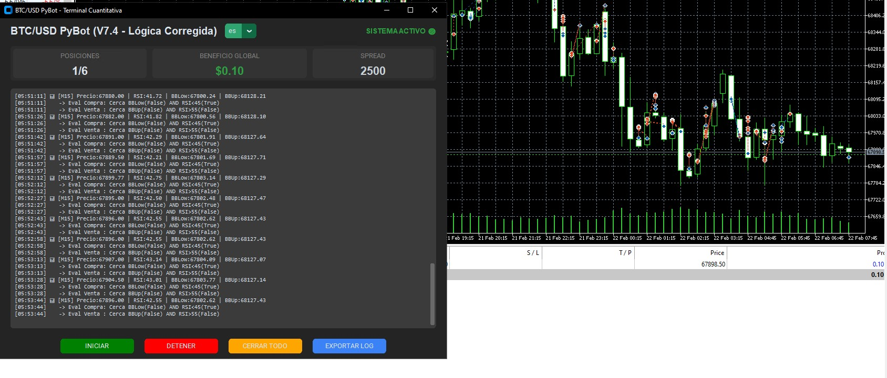

# 🤖 BTC/USD PyBot - Python and Metatrader 5 Bitcoin Bot

🇪🇸 [Versión en Español](#español) | 🇬🇧 [English Version](#english)

---

<a name="español"></a>
## 🇪🇸 Español

**BTC/USD PyBot** es un bot de trading algorítmico automatizado diseñado específicamente para el par BTC/USD en MetaTrader 5. Utiliza una interfaz gráfica moderna (GUI) y emplea una estrategia de "Grid Trading" basada en la reversión a la media mediante Bandas de Bollinger y RSI.



### ✨ Características Principales
* **Estrategia Cuantitativa:** Entradas precisas usando Bandas de Bollinger (desviación 2.0) y RSI en temporalidad M15.
* **Grid Trading Seguro:** Distanciamiento de operaciones basado en dólares exactos (no puntos), ideal para la volatilidad de las criptomonedas.
* **Gestión de Riesgo Integrada:** Cierre automático por "Basket" (Bloque) al alcanzar un beneficio objetivo, y Stop Loss Global de emergencia.
* **Interfaz Gráfica (GUI):** Panel de control oscuro y moderno creado con CustomTkinter para monitorizar posiciones, flotante y spread en tiempo real.
* **Notificaciones de Telegram:** Alertas en tiempo real sobre aperturas de operaciones, toma de ganancias (Take Profit) y conexión al broker.
* **Logs Detallados:** Exportación de registros y monitorización bilingüe (ES/EN) directa en pantalla.

### 📋 Requisitos Previos e Instalación

1. **Registro en el Broker Recomendado:**
   Para garantizar que el bot funcione correctamente con los spreads y requisitos de lotaje (0.01) programados, es obligatorio registrarse en este broker:
   👉 **[Crear cuenta de Trading Aquí](https://elev8link.com/i8VlxbPAZYr)**

2. **Instalar Python:** Asegúrate de tener Python 3.9 o superior instalado.
3. **Clonar el repositorio y preparar el entorno:**
   ```bash
   git clone [https://github.com/hernantvg/btc-usd-pybot.git](https://github.com/hernantvg/btc-usd-pybot.git)
   cd btc-usd-pybot
   pip install -r requirements.txt
   ```

### ⚙️ Configuración (Archivo `.env`)
Crea un archivo llamado `.env` en la raíz del proyecto y añade tus credenciales (nunca compartas este archivo públicamente):

```env
ACCOUNT_NUMBER=12345678
PASSWORD=tu_contraseña_de_mt5
SERVER=NombreDelServidor-Live
TELEGRAM_TOKEN=tu_token_de_botfather
TELEGRAM_CHAT_ID=tu_chat_id
```

### 🚀 Uso
Abre tu terminal de MetaTrader 5 (asegúrate de que el botón "Algo Trading" esté activado) y ejecuta el bot:
```bash
python run.py
```
*(Haz clic en "INICIAR" en la interfaz gráfica para que el algoritmo comience a analizar el mercado).*

---

<a name="english"></a>
## 🇬🇧 English

**BTC/USD PyBot** is an automated algorithmic trading bot designed specifically for the BTC/USD pair on MetaTrader 5. It features a modern graphical user interface (GUI) and employs a "Grid Trading" strategy based on mean reversion using Bollinger Bands and RSI.


### ✨ Key Features
* **Quantitative Strategy:** Precise entries using Bollinger Bands (2.0 dev) and RSI on the M15 timeframe.
* **Safe Grid Trading:** Trade spacing based on exact USD amounts (not points), making it ideal for cryptocurrency volatility.
* **Integrated Risk Management:** Automatic "Basket" closure upon reaching a target profit, and an emergency Global Stop Loss.
* **Graphical Interface (GUI):** Modern dark dashboard built with CustomTkinter to monitor positions, floating profit, and live spread.
* **Telegram Notifications:** Real-time alerts for trade entries, profit taking, and broker connection status.
* **Detailed Logs:** Exportable logs and real-time bilingual (ES/EN) monitoring on screen.

### 📋 Prerequisites & Installation

1. **Recommended Broker Registration:**
   To ensure the bot works correctly with the programmed spreads and lot size requirements (0.01), it is highly recommended to register with this broker:
   👉 **[Create your Trading Account Here](https://elev8link.com/i8VlxbPAZYr)**

2. **Install Python:** Ensure you have Python 3.9 or higher installed.
3. **Clone the repository and setup environment:**
   ```bash
   git clone [https://github.com/hernantvg/btc-usd-pybot.git](https://github.com/hernantvg/btc-usd-pybot.git)
   cd btc-usd-pybot
   pip install -r requirements.txt
   ```

### ⚙️ Configuration (`.env` file)
Create a file named `.env` in the root directory and add your credentials (never share this file publicly):

```env
ACCOUNT_NUMBER=12345678
PASSWORD=your_mt5_password
SERVER=BrokerServerName-Live
TELEGRAM_TOKEN=your_botfather_token
TELEGRAM_CHAT_ID=your_chat_id
```

### 🚀 Usage
Open your MetaTrader 5 terminal (ensure the "Algo Trading" button is enabled) and run the bot:
```bash
python run.py
```
*(Click "START" on the graphical interface to allow the algorithm to begin analyzing the market).*

---
⚠️ **Disclaimer:** Trading cryptocurrencies and using algorithmic bots involves significant risk of loss. This software is provided "as is" without any guarantees. Always test on a demo account first.